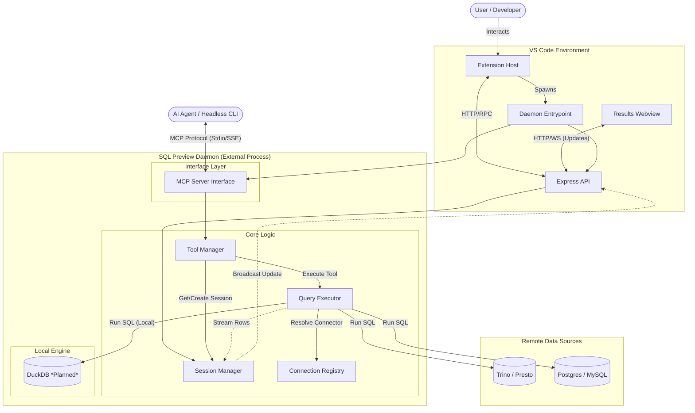

# System Architecture Overview

This diagram provides a high-level view of the entire SQL Preview ecosystem, showing how VS Code and external Agents interact with the Daemon to query data.

```mermaid
graph TD
    %% --- Actors ---
    User([User / Developer])
    Agent([AI Agent / Headless CLI])

    %% --- VS Code Context ---
    subgraph "VS Code Environment"
        direction TB
        ExtHost[Extension Host]
        Webview[Results Webview]

        ExtHost -- "Spawns" --> DaemonProcess
        ExtHost <-->|"HTTP/RPC"| API
        Webview <-->|"HTTP/WS (Updates)"| API
    end

    %% --- The Daemon Core ---
    subgraph "SQL Preview Daemon (External Process)"
        direction TB
        DaemonProcess[Daemon Entrypoint]

        subgraph "Interface Layer"
            API[Express API]
            MCP[MCP Server Interface]
        end

        subgraph "Core Logic"
            SessMgr[Session Manager]
            ToolMgr[Tool Manager]
            QueryExec[Query Executor]
            ConnRegistry[Connection Registry]
        end

        subgraph "Local Engine"
            DuckDB[(DuckDB *Planned*)]
        end
    end

    %% --- External Data Sources ---
    subgraph "Remote Data Sources"
        Trino[(Trino / Presto)]
        Postgres[(Postgres / MySQL)]
    end

    %% --- Interactions ---
    User -->|Interacts| ExtHost
    Agent <-->|"MCP Protocol (Stdio/SSE)"| MCP

    %% --- Internal Wiring ---
    DaemonProcess --> API
    DaemonProcess --> MCP

    API --> SessMgr
    MCP --> ToolMgr

    ToolMgr -->|"Get/Create Session"| SessMgr
    ToolMgr -->|"Execute Tool"| QueryExec

    QueryExec -->|"Resolve Connector"| ConnRegistry

    %% --- Data Flow ---
    QueryExec -->|"Run SQL"| Trino
    QueryExec -->|"Run SQL"| Postgres
    QueryExec -->|"Run SQL (Local)"| DuckDB

    %% --- Feedback Loop ---
    QueryExec -.->|"Stream Rows"| SessMgr
    SessMgr -.->|"Broadcast Update"| API
```
