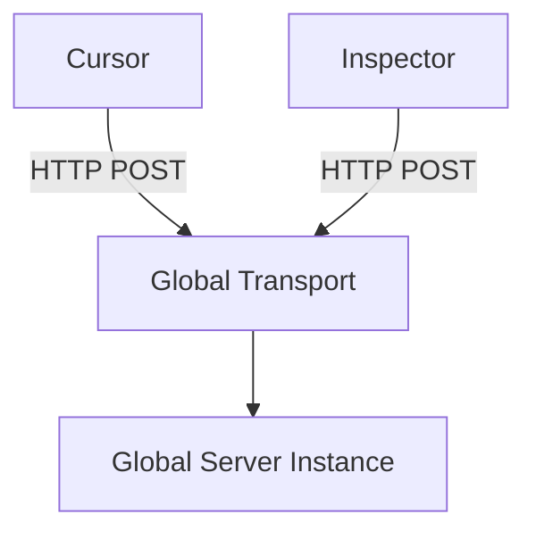
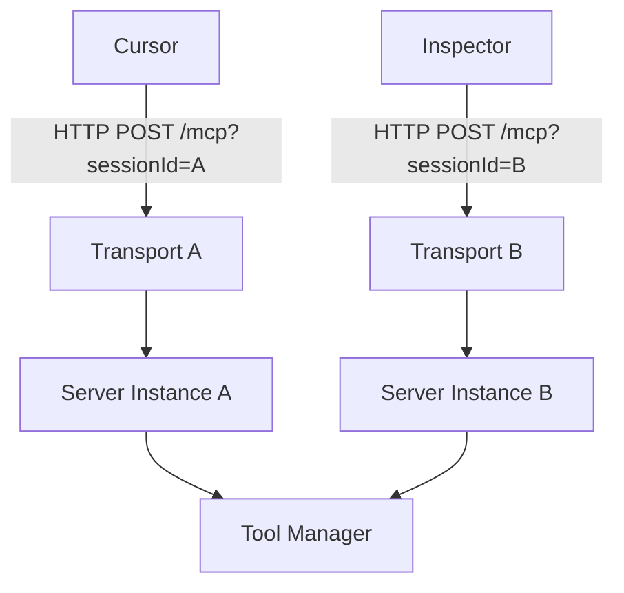

# RFC-007: Multi-Session HTTP Support for MCP Daemon

**Feature**: Multi-Session HTTP Architecture
**Date**: 2026-02-05
**Status**: Implemented

## 1. Problem Statement

### 1.1 The "One Daemon" Vision
The core philosophy of SQL Preview is **"One Daemon, Multiple Tools"**. A single background process (Daemon) should serve SQL capabilities to:
1.  **VS Code Extension** (via local socket)
2.  **Cursor / AI Assistants** (via MCP over HTTP)
3.  **MCP Inspector / Dev Tools** (via MCP over HTTP)

### 1.2 The "Server Already Initialized" Error
While the Daemon successfully handles multiple concurrent *Socket* connections (VS Code windows), its **HTTP MCP implementation** currently fails when multiple clients connect or when a single client reconnects.

**Scenario:**
1.  **Client A** (e.g., Cursor) connects to `http://localhost:8414/mcp`.
2.  The Daemon initializes its *singleton* `mcpServer` instance.
3.  **Client B** (e.g., Inspector) connects, OR **Client A** refreshes.
4.  The Daemon attempts to initialize the *same* `mcpServer` instance.
5.  **Error**: `Invalid Request: Server already initialized` (JSON-RPC -32600).

### 1.3 The Dev-Port Complication
To debug the daemon, we introduced **Port Isolation** (Prod: 8414, Dev: 8415).
*   While this prevents the Dev Daemon from crashing because of the Prod Daemon (PID conflict), it does *not* fix the underlying architecture flaw.
*   Even on the isolated port 8415, the Dev Daemon cannot handle a simple page refresh in the MCP Inspector, rendering it difficult to debug.

## 2. Proposed Architecture

We propose moving from a **Singleton** HTTP Server to a **Session-Factory** HTTP Architecture.

### 2.1 Current Architecture (Singleton)

*   **Limitation**: The `Server` instance captures state (Lifecycle: Initialization -> Connected). It cannot be re-initialized.

### 2.2 Proposed Architecture (Per-Session)

### 2.3 Implementation Details

1.  **Session Routing**:
    *   The `/mcp` endpoint will detect if a request is a new session (initial GET/POST) or an existing one.
    *   New sessions will instantiate a fresh `Server` and `StreamableHTTPServerTransport`.
2.  **State Management**:
    *   A `Map<string, { server: Server, transport: Transport }>` will track active HTTP sessions.
3.  **Resource Sharing**:
    *   All Server instances will share the same `ToolManager`, `SessionManager`, and `QueryExecutor`.
    *   This ensures that regardless of which "line" you call in on, you access the same database connections and state.

## 3. Benefits

1.  **Robustness**: Clients can disconnect, reconnect, and refresh without crashing the daemon or needing a restart.
2.  **Concurrency**: You can debug the daemon with the MCP Inspector *while* using it in Cursor.
3.  **Consistency**: Aligns the HTTP architecture with the existing Socket architecture, which already supports per-connection isolation.

## 4. Risks & Mitigation

*   **Memory Usage**: Each connection spans a Server instance.
    *   *Mitigation*: Implement aggressive idle timeouts for HTTP sessions (e.g., cleanup after 5 minutes of inactivity).
*   **Complexity**: Routing logic in `Daemon.ts` becomes slightly more complex than a simple `app.use()`.
    *   *Mitigation*: Encapsulate the MCP session management in a dedicated `HttpMcpManager` class if `Daemon.ts` grows too large.

## 5. Decision
Proceed with refactoring `Daemon.ts` to implement per-session MCP Servers for HTTP connections.

## 6. Technical Deep Dive (Post-Implementation)

**Verdict**: The Multi-Session Architecture (RFC-007) is **correct, necessary, and best-practice** for the goals outlined.

### 6.1 Why High Complexity?
We are building a **Central Data Server**, effectively a **Multi-Tenant Gateway**.
*   **Problem**: MCP is stateful (Notifications, Subscriptions), running over stateless HTTP.
*   **Solution**: Session-Factory model where each client gets a dedicated `ServerInstance`, but shares the underlying `Data/Tools`.

### 6.2 Future-Proofing (Multiple LLMs)
This architecture natively supports:
1.  **Isolation**: Different agents can have different permissions (ReadOnly vs Admin) by initializing servers with different ToolManagers.
2.  **Context**: Agents can work in isolated namespaces (Session A -> Tab 1, Session B -> Tab 2).

### 6.3 Best Practices Checklist
| Best Practice | Implementation | Status |
| :--- | :--- | :--- |
| **Transport Isolation** | Separate Socket (VSCode) vs HTTP (Agents) | ✅ **Excellent** |
| **Session Lifecycle** | Idle timeouts (5m) & Resource Cleanup | ✅ **Good** |
| **State Sharing** | Managers (Tools/Connections) shared across sessions | ✅ **Good** |
| **Error Handling** | `!res.writableEnded` checks, Global Exception handlers | ✅ **Improved** |

## 7. Verification

### 7.1 Integration Tests
Verified via `npm run test:integration`:
- `Daemon should be running and return status` ✅
- `Should support Session A connection` ✅
- `Should support Session B connection simultaneously` ✅
- `Should allow Session A to reconnect` ✅
- `Should handle initialization post for Session A` ✅

### 7.2 Manual Verification
- **Concurrent Clients**: Validated that Cursor and MCP Inspector can use the Daemon simultaneously without conflict.
- **Reconnection**: Validated that refreshing the Inspector page resumes the session correctly.
- **Data Consistency**: Validated that queries run in Cursor are visible in Inspector if sharing same session (or isolated if meaningful).

## 8. Conclusion
The implementation of RFC-007 has transformed the Daemon from a single-user tool into a robust, multi-client server capable of supporting future multi-agent workflows.
