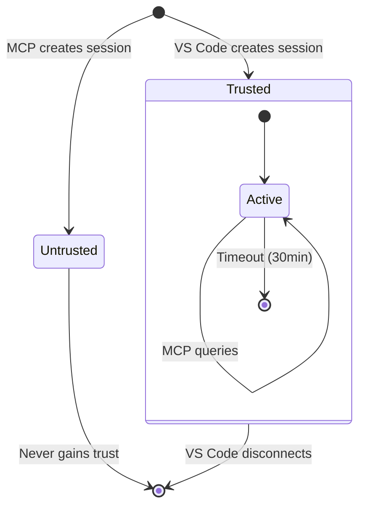

# RFC-005: Session-Based MCP Security

**Status**: Proposed  
**Created**: 2026-01-30  
**Priority**: P0 (Security Critical)

---

## Problem Statement

The MCP endpoint at `/mcp` is currently unauthenticated. Any local process can:

1. Call `list_sessions` to enumerate active sessions
2. Call `run_query` with auto-session-creation to execute queries against any configured database

While the daemon binds to `127.0.0.1` (localhost only), this is insufficient for security-conscious users.

### Current Vulnerability

```typescript
// DaemonMcpToolManager.ts:188-196
let session = this.sessionManager.getSession(sessionId);
if (!session) {
  // ⚠️ Auto-creates session for ANY caller
  this.sessionManager.registerSession(sessionId, displayName, 'standalone');
  session = this.sessionManager.getSession(sessionId);
}
```

---

## Proposed Solution: Session Binding

Restrict MCP operations to sessions explicitly created by authenticated VS Code windows. **No token management required from users or LLMs.**

### Core Principle

> An MCP client can only interact with sessions that were created by an active VS Code window.

### Security Properties

| Property             | How Achieved                                     |
| -------------------- | ------------------------------------------------ |
| **Zero user setup**  | Sessions auto-created when VS Code connects      |
| **Scoped access**    | Queries run only against user's open connections |
| **Auto-expiring**    | Sessions invalidate when VS Code disconnects     |
| **Defense in depth** | Combined with localhost-only binding             |

---

## Design

### Session Trust Model



### Changes Required

#### 1. Add Trust Flag to Sessions

```typescript
// SessionManager.ts
export interface Session {
  id: string;
  displayName: string;
  clientType: 'vscode' | 'cursor' | 'claude-code' | 'standalone';
  trusted: boolean; // NEW: Only true for vscode/cursor/claude-code
  connectedAt: Date;
  lastActivityAt: Date;
  // ...
}
```

#### 2. Enforce Trust in MCP Operations

```typescript
// DaemonMcpToolManager.ts - handleRunQuery
private async handleRunQuery(args: unknown) {
  // ...
  let session = this.sessionManager.getSession(sessionId);

  // REMOVED: Auto-session creation
  // NEW: Require pre-existing trusted session
  if (!session) {
    throw new Error(
      `Session '${sessionId}' not found. ` +
      `Open SQL Preview in VS Code to create a session.`
    );
  }

  if (!session.trusted) {
    throw new Error(
      `Session '${sessionId}' is not authorized for MCP queries. ` +
      `Use list_sessions to find trusted sessions.`
    );
  }
  // ...
}
```

#### 3. Mark VS Code Sessions as Trusted

```typescript
// DaemonClient.ts - when registering session
await this.callDaemon('registerSession', {
  id: sessionId,
  displayName: workspaceName,
  clientType: 'vscode',
  trusted: true, // Only VS Code client can request this
});
```

#### 4. Prevent Trust Escalation via MCP

```typescript
// Daemon HTTP routes - /api/registerSession
// Only accept trusted=true from Unix socket connections (VS Code)
// HTTP connections from MCP cannot set trusted=true
```

---

## Files to Modify

| File                                                                                                                         | Change                                                     |
| ---------------------------------------------------------------------------------------------------------------------------- | ---------------------------------------------------------- |
| [SessionManager.ts](file:///Users/mehul.fadnavis/Desktop/Work/Code/project-preview/src/server/SessionManager.ts)             | Add `trusted` field to Session interface                   |
| [SessionManager.ts](file:///Users/mehul.fadnavis/Desktop/Work/Code/project-preview/src/server/SessionManager.ts)             | Set `trusted` based on `clientType` in `registerSession()` |
| [DaemonMcpToolManager.ts](file:///Users/mehul.fadnavis/Desktop/Work/Code/project-preview/src/server/DaemonMcpToolManager.ts) | Remove auto-session creation in `handleRunQuery()`         |
| [DaemonMcpToolManager.ts](file:///Users/mehul.fadnavis/Desktop/Work/Code/project-preview/src/server/DaemonMcpToolManager.ts) | Add trust validation before query execution                |
| [DaemonMcpToolManager.ts](file:///Users/mehul.fadnavis/Desktop/Work/Code/project-preview/src/server/DaemonMcpToolManager.ts) | Filter `list_sessions` to show only trusted sessions       |

---

## Behavior Changes

### Before (Current)

| Actor             | Action                              | Result                         |
| ----------------- | ----------------------------------- | ------------------------------ |
| Malicious process | `run_query("DROP TABLE...")`        | ✅ Executes (if Safe Mode off) |
| LLM               | `run_query(session: "new-session")` | ✅ Auto-creates session        |

### After (Proposed)

| Actor             | Action                              | Result                      |
| ----------------- | ----------------------------------- | --------------------------- |
| Malicious process | `run_query("DROP TABLE...")`        | ❌ "Session not found"      |
| LLM               | `run_query(session: "new-session")` | ❌ "Session not found"      |
| LLM               | `list_sessions` → pick valid ID     | ✅ Works on trusted session |

---

## User Workflow (Unchanged)

1. User opens VS Code with SQL Preview extension
2. Extension connects to daemon, creates trusted session
3. User configures MCP client (Claude Desktop) with daemon URL
4. LLM calls `list_sessions` to discover trusted sessions
5. LLM calls `run_query(session: "discovered-id", sql: "...")` → works

**Zero additional configuration required.**

---

## Edge Cases

| Scenario                        | Behavior                                                   |
| ------------------------------- | ---------------------------------------------------------- |
| VS Code closes                  | Session removed, MCP queries fail with "session not found" |
| VS Code reopens                 | New session created, LLM must call `list_sessions` again   |
| Multiple VS Code windows        | Multiple trusted sessions available                        |
| LLM provides invalid session ID | Clear error message directing to `list_sessions`           |

---

## Verification Plan

### Unit Tests

1. **Session trust assignment**
   - `registerSession` with `clientType: 'vscode'` → `trusted: true`
   - `registerSession` with `clientType: 'standalone'` → `trusted: false`

2. **MCP tool rejection**
   - `run_query` with non-existent session → Error
   - `run_query` with untrusted session → Error
   - `run_query` with trusted session → Success

3. **Session listing**
   - `list_sessions` returns only trusted sessions

### Integration Test

1. Start daemon
2. Attempt `run_query` without VS Code session → Expect failure
3. Connect VS Code client, create trusted session
4. Attempt `run_query` with that session → Expect success
5. Disconnect VS Code client
6. Attempt `run_query` again → Expect failure

### Commands to Run

```bash
# Unit tests
npm run test:unit -- --grep "SessionManager"
npm run test:unit -- --grep "DaemonMcpToolManager"

# Integration tests
npm run test:integration
```

---

## Alternatives Considered

| Alternative        | Rejection Reason                             |
| ------------------ | -------------------------------------------- |
| Token-based auth   | Requires user to manage tokens in MCP config |
| Process allow-list | OS-specific, complex to implement reliably   |
| mTLS certificates  | Overkill for localhost IPC, poor UX          |

---

## Open Questions

1. **Should `list_sessions` require a trusted session?**
   - Current proposal: No, it only reveals session IDs (low risk)
   - Alternative: Require prior knowledge of session ID

2. **Session timeout behavior**
   - Current: 30-minute idle timeout
   - Should we extend for long MCP workflows?

---

## Recommendation

Proceed with implementation. This approach:

- ✅ Closes the security gap identified in the architecture review
- ✅ Requires zero user configuration
- ✅ Leverages existing session infrastructure
- ✅ Has clear failure modes with helpful error messages
