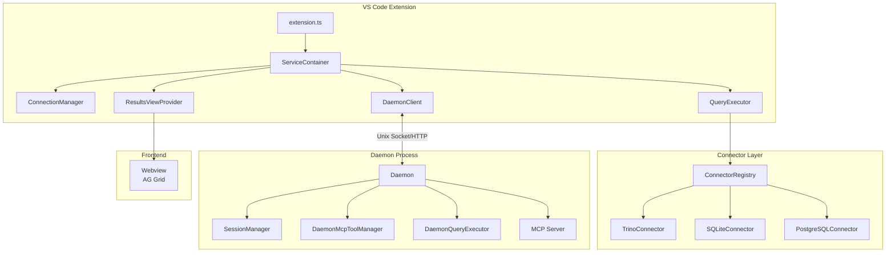

# SQL Preview Architecture Review

**Reviewer:** Senior Principal Engineer  
**Date:** January 30, 2026  
**Repository:** `fadnavismehul/sql-preview-cursor`  
**Version:** 0.4.5

---

## Executive Summary

SQL Preview is a VS Code extension for running SQL queries against Presto/Trino databases with an integrated MCP (Model Context Protocol) server for LLM agent interaction. The codebase demonstrates **solid foundational architecture** with room for improvement before open-source release.

| Criterion         | Current State | Open Source Readiness                    |
| ----------------- | ------------- | ---------------------------------------- |
| **Extensibility** | 🟢 Good       | Ready with minor improvements            |
| **Scale**         | 🟡 Moderate   | Needs attention for production workloads |
| **Reliability**   | 🟡 Moderate   | Test coverage gaps to address            |
| **Security**      | 🟢 Good       | Solid foundation, minor hardening needed |

---

## Architecture Overview



---

## 1. Extensibility ✅

### Strengths

1. **Clean Connector Interface** ([IConnector.ts](file:///Users/mehul.fadnavis/Desktop/Work/Code/project-preview/src/connectors/base/IConnector.ts))
   - Generic `IConnector<TConfig>` interface with proper abstraction
   - `ConnectorRegistry` pattern enables easy addition of new database types
   - Each connector validates its own configuration

2. **Dependency Injection via ServiceContainer** ([ServiceContainer.ts](file:///Users/mehul.fadnavis/Desktop/Work/Code/project-preview/src/services/ServiceContainer.ts))
   - Singleton pattern with lazy initialization
   - Clean separation of concerns between services
   - Easy to mock for testing

3. **MCP Server Architecture**
   - Pluggable tool system via `DaemonMcpToolManager`
   - Standard MCP SDK integration
   - Supports both HTTP and Unix socket transports

### Gaps & Recommendations

| Gap                                           | Impact                                  | Recommendation                                                                     |
| --------------------------------------------- | --------------------------------------- | ---------------------------------------------------------------------------------- |
| `ResultsViewProvider` is 1,131 lines          | Hard to maintain/extend                 | Extract into smaller classes: `TabController`, `MessageHandler`, `SettingsManager` |
| No plugin/extension API for custom connectors | Limits community contributions          | Consider dynamic connector loading from user-defined paths                         |
| Hardcoded connector registration              | Requires code changes to add connectors | Move to configuration-based registration                                           |

---

## 2. Scale ⚠️

### Strengths

1. **Streaming Query Results**
   - `AsyncGenerator` pattern for paginated results
   - Efficient memory usage for large result sets
   - `maxRowsToDisplay` configuration (default: 500)

2. **Session Management**
   - Clean session isolation with `SessionManager`
   - Per-tab result storage with abort controller support

3. **Idle Timeout**
   - 30-minute auto-shutdown for daemon when no clients connected
   - Prevents resource leakage

### Gaps & Recommendations

| Gap                                   | Severity | Recommendation                                                                  |
| ------------------------------------- | -------- | ------------------------------------------------------------------------------- |
| **No connection pooling**             | High     | Implement connection pooling for Trino/Postgres connectors                      |
| **In-memory result storage**          | High     | For large results, consider disk-backed storage or streaming to client          |
| **Single-threaded daemon**            | Medium   | Results stored in memory could block; consider worker threads for heavy queries |
| **No rate limiting on MCP endpoints** | Medium   | Add rate limiting to prevent denial-of-service                                  |
| **Unbounded session growth**          | Medium   | Add maximum session limit and LRU eviction                                      |

### Specific Code Concerns

```typescript
// DaemonMcpToolManager.ts:281 - All rows stored in memory
tab.rows.push(...page.data); // ⚠️ Could OOM for large result sets
```

**Recommendation:** Implement result pagination with lazy loading:

```typescript
// Store reference to paginated source instead of all rows
tab.resultSource = generator;
tab.rowsLoaded = 0;
```

---

## 3. Reliability ⚠️

### Test Coverage Summary

| Component                 | Statements   | Branches | Lines  |
| ------------------------- | ------------ | -------- | ------ |
| **Overall**               | 64.78%       | 47.55%   | 65.15% |
| `src/server`              | 88.93% ✅    | 60.91%   | 88.79% |
| `src/services`            | 73.4%        | 62.03%   | 74.5%  |
| `src/connectors/postgres` | **3.44%** ⚠️ | 0%       | 3.57%  |
| `src/` (root)             | 43.72%       | 24.73%   | 44.2%  |

### Strengths

1. **Comprehensive Unit Test Suite**
   - 18 unit test files covering core functionality
   - Integration test infrastructure (`test/suite/`)
   - Pre-commit hooks with husky

2. **Error Handling in Daemon**
   - Global `uncaughtException` and `unhandledRejection` handlers
   - Graceful shutdown on SIGINT/SIGTERM
   - PID file for singleton enforcement

3. **Configuration Validation**
   - Connectors validate their own config
   - Input sanitization for host/port

### Gaps & Recommendations

| Gap                                    | Priority    | Recommendation                                                |
| -------------------------------------- | ----------- | ------------------------------------------------------------- |
| PostgreSQL connector untested          | 🔴 Critical | Write comprehensive tests or remove from default registration |
| Branch coverage at 47%                 | 🟡 High     | Focus on error paths and edge cases                           |
| `ResultsViewProvider` largely untested | 🟡 High     | Add tests for webview message handling                        |
| No E2E tests                           | 🟡 Medium   | Add Playwright or similar for UI testing                      |
| No load testing                        | 🟡 Medium   | Add stress tests for concurrent queries                       |

> [!WARNING]
> **Before Open Source Release:** The PostgreSQL connector should either be fully tested or marked as experimental/beta. Having a 3.44% coverage connector could lead to production issues and erode community trust.

---

## 4. Security ✅

### Strengths

1. **Secure Password Storage** ([ConnectionManager.ts](file:///Users/mehul.fadnavis/Desktop/Work/Code/project-preview/src/services/ConnectionManager.ts))
   - Uses VS Code's `SecretStorage` API (OS-level encryption)
   - Passwords never stored in plaintext in globalState
   - Legacy password migration support

2. **MCP Safe Mode**
   - `sqlPreview.mcpSafeMode` setting (default: true)
   - Restricts to read-only queries (SELECT, SHOW, DESCRIBE)

3. **Local-Only Binding**
   - Daemon binds to `127.0.0.1` only
   - Unix socket for IPC (additional security layer)

4. **Input Validation**
   - Host sanitization to prevent protocol injection
   - Port range validation (1024-65535)

### Gaps & Recommendations

| Gap                                        | Severity  | Recommendation                                                         |
| ------------------------------------------ | --------- | ---------------------------------------------------------------------- |
| **No authentication on MCP HTTP endpoint** | 🔴 High   | Add API key or JWT authentication                                      |
| **No TLS on daemon HTTP**                  | 🟡 Medium | Add optional TLS support (`https`)                                     |
| **SQL injection surface**                  | 🟡 Medium | Document safe mode limitations; parameterized queries for internal use |
| **No audit logging**                       | 🟡 Low    | Add query audit trail for security-conscious users                     |
| **CORS is permissive**                     | 🟡 Low    | Tighten CORS policy (currently `cors()` with defaults)                 |

> [!CAUTION]
> **Security Critical:** The MCP endpoint at `/mcp` is currently unauthenticated. Any local process can execute queries. For open-source release, consider:
>
> 1. Token-based authentication
> 2. Session binding to originating VS Code window
> 3. Allow-list for caller processes

---

## Priority Action Items

### Before Open Source Launch (P0)

1. **Add MCP Authentication**
   - Generate per-session tokens
   - Store in `~/.sql-preview/auth.json`
   - Require token header for all MCP requests

2. **Fix PostgreSQL Connector**
   - Either add comprehensive tests (target 80% coverage)
   - Or mark as experimental and add warning in README

3. **Memory Safety for Large Results**
   - Add configurable memory limit
   - Implement streaming to disk for results > threshold
   - Add result size warning in UI

4. **Break Up ResultsViewProvider**
   - Extract message handling
   - Extract tab management
   - Extract settings synchronization

### Short-Term (P1)

5. **Connection Pooling**
   - Implement for Trino connector using existing client capabilities
   - Add pool size configuration

6. **Rate Limiting**
   - Add express-rate-limit to MCP endpoints
   - Configure via settings

7. **Increase Branch Coverage**
   - Target 70% branch coverage
   - Focus on error handling paths

### Medium-Term (P2)

8. **E2E Testing Framework**
   - Set up Playwright for webview testing
   - Add CI workflow

9. **Plugin Architecture**
   - Allow dynamic connector registration
   - Document extension API

10. **Audit Logging**
    - Optional query logging for compliance
    - Configurable log retention

---

## Positive Highlights 🌟

1. **Well-organized codebase** - Clear separation between `server/`, `services/`, `connectors/`, `utils/`
2. **Good developer experience** - Pre-commit hooks, ESLint, Prettier, TypeScript strict mode
3. **Modern stack** - MCP SDK, Express 5, AG Grid, esbuild
4. **Documentation** - CONTRIBUTING.md, Changelog, issue templates exist
5. **CI/CD ready** - Package scripts for VS Code and OpenVSX publishing

---

## Conclusion

SQL Preview has a **solid architectural foundation** suitable for open-source release with targeted improvements. The main concerns are:

1. **Security:** Unauthenticated MCP endpoint (critical fix needed)
2. **Reliability:** PostgreSQL connector coverage gap
3. **Scale:** Memory safety for large result sets

Addressing the P0 items above should take approximately **2-3 weeks** of focused development. The codebase is well-structured for community contributions once these issues are resolved.

**Recommendation:** Proceed with open-source preparation after addressing P0 items. The architecture is sound and the codebase is maintainable.
