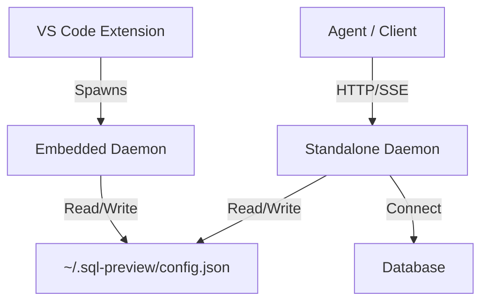

# RFC-009: Headless MCP Server

**Status:** Implemented
**Created:** 2026-02-15
**Owner:** @mehul.fadnavism  
**Related ADRs:** None

## Goal

Enable the SQL Preview MCP server to run as a standalone process (Headless), decoupled from VS Code, to support Agentic workflows in environments like Claude Desktop, Cursor, and CI/CD pipelines.

## Problem Statement

Currently, the SQL Preview MCP server is tightly coupled to the VS Code extension lifecycle. It is launched by the extension and relies on the extension process for initialization in some contexts. This makes it impossible for tools like Claude Desktop to use the server without running VS Code, limiting its utility as a general-purpose "Agentic Data Analyst" tool.

## Scope

**In Scope:**

- Creating a new entry point (`bin/server.ts`) for standalone execution.
- configuring `esbuild` to produce a standalone executable/script.
- Updating `package.json` to expose a `bin` command.
- Ensuring `Daemon.ts` and its dependencies are free of `vscode` module imports.

**Out of Scope:**

- Removing the VS Code extension (it will remain the primary GUI).
- Refactoring the entire project structure (monorepo is a future goal).

## Proposal

We will introduce a "Headless Mode" for the Daemon.

1.  **Entry Point**: Create `src/bin/server.ts` that initializes the `Daemon` class directly.
2.  **Configuration**: The headless server will read configuration from:
    - Environment Variables (e.g., `SQL_PREVIEW_PORT`, `MCP_PORT`).
    - Command Line Arguments (e.g., `--port 8414`).
    - `~/.sql-preview/config.json` (for connections).
3.  **Distribution**: The package will be publishable to npm, allowing users to run `npx @sql-preview/server` (or similar) to start it.

### Architecture

Both Standalone and Embedded modes share the same `Daemon` class and `Core` logic. The `Daemon.ts` file acts as the bridge.

## Alternatives Considered

- **Hybrid Mode (Port Forwarding)**: Asking users to keep VS Code open and connect to its port.
  - _Tradeoff_: High friction for the user; requires VS Code to be running.
- **Rewrite in Python**: Creating a separate python-based MCP server.
  - _Tradeoff_: Duplicate maintenance of connection logic and query parsing.

## Implementation Plan

1.  **Dependency Check**: Verify `src/server` has no `vscode` imports (Completed).
2.  **Create Entry Point**: `src/server/standalone.ts` (or `bin/server.ts`).
3.  **Build Config**: Add `esbuild-standalone` script to `package.json`.
4.  **CLI Args**: Use `minimist` or simple `process.argv` parsing for flags.
5.  **Validation**: Test connection via `npx` from Claude Desktop config.

## Acceptance Criteria

1.  User can run `node out/server/standalone.js` and see "Daemon listening".
2.  Claude Desktop can connect to this server instance.
3.  `run_query` works without VS Code running.
4.  Standard output logs are clean and formatted for CLI.

## Risks and Mitigations

- **Risk**: Shared state (config.json) between VS Code and Standalone might cause conflicts.
  - _Mitigation_: Use file locking or robust error handling when reading/writing config.
- **Risk**: Authentication via VS Code Secret Storage is not available in headless mode.
  - _Mitigation_: Support environment variable based auth or a plaintext/encrypted local config fallbacks.

## Rollout and Backout

- **Rollout**: Publish as a new version or separate npm package.
- **Backout**: Revert changes to `package.json`. The new file `standalone.ts` is additive and non-breaking.

## Open Questions

1.  Should we split this into a separate npm package `@sql-preview/server` to avoid downloading the VS Code extension assets? (For now, single package is fine).
